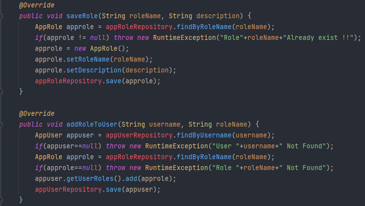
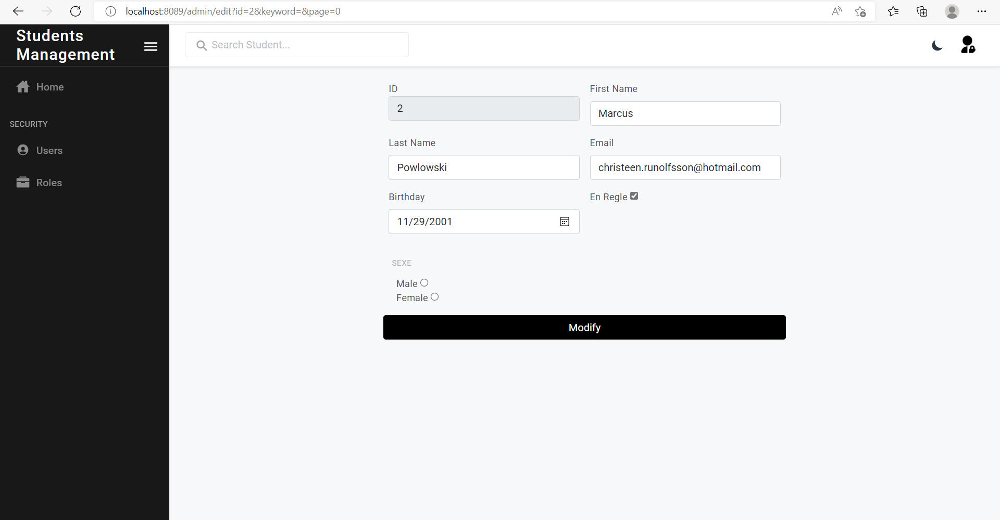

# TP6 : Activité Pratique Spring MVC Thymeleaf

 <h2>Enoncé</h2> 

Créer une application Web basée sur Spring MVC, Spring Data JPA et Spring Security qui permet de gérer des étudiants.
Chaque étudiant est défini par:
 - Son id
 - Son nom
 - Son prénom
 - Son email
 - Sa date naissance
 - Son genre : MASCULIN ou FEMININ
 - Un attribut qui indique si il est en règle ou non
L'application doit offrir les fonctionnalités suivantes :
  - Chercher des étudiants par nom
  - Faire la pagination
  - Supprimer des étudiants en utilisant la méthode (DELETE au lieu de GET)
  - Saisir et Ajouter des étudiants avec validation des formulaires
  - Editer et mettre à jour des étudiants
  - Créer une page template 
  - Sécuriser l'accès à l'application avec un système d'authentification basé sur Spring security en utilisant la stratégie UseDetails Service
 - Ajouter d'autres fonctionnalités supplémentaires

 <h2>Conception</h2> 

  

 <h2>Captures d'écran</h2> 

<ol>
<ul><h4>Entities</h4>
  <ul><h6>Student</h6></ul>
  
</ul>
<ul><h4>Enums</h4>
  <ul><h6>Sexe</h6></ul>
  
</ul>

<ul><h4>Repositories</h4>
  <ul><h6>Student Repository</h6></ul>
  
</ul>

<ul><h4>Services</h4>
  <ul><h6>StudentService Interface</h6></ul>
  
  <ul><h6>StudentService Implementation</h6></ul>
  
</ul>

<ul><h4>Controllers</h4>
  <ul><h6>Student Controller</h6></ul>
  
  
  
</ul>

<ul><h4>Security</h4>
  <ul><h5>Entities</h5>
  <ul><h6>AppUser</h6></ul>
  
  <ul><h6>AppRole</h6></ul>
  
  </ul>

  <ul><h5>Repositories</h5>
    <ul><h6>AppUser Repository</h6></ul>
    
    <ul><h6>AppRole Repository</h6></ul>
    
  </ul>

  <ul><h5>Services</h5>
    <ul><h6>Security service</h6></ul>
    
    <ul><h6>Security service Implementation</h6></ul>
    
    
    
    <ul><h6>UserDetails service Implementation</h6></ul>
    
  </ul>

  <ul><h5>Controllers</h5>
    <ul><h6>Security Controller</h6></ul>
    
  </ul>

  <ul><h5>Configuration</h5>
    <ul><h6>Security Config</h6></ul>
    
  </ul>
</ul>
</ol>

 <h2>Interfaces</h2> 

<ol>
  <ul><h4>Login page</h4>
    
  </ul>
  <ul><h4>Login en tant que ADMIN</h4>
    <ul><h6>Home</h6></ul>
    
    <ul><h6>Add Student</h6></ul>
      
      
    <ul><h6>Update Student</h6></ul>
      
      
    <ul><h6>Delete Student</h6></ul>
      
      
      
  </ul>
  <ul><h6>Login en tant qu'USER</h6>
    
USER ne peut que voir la liste des patients et faire une recherche

    
  </ul>
</ol>

