# E-Bank : application bancking basée sur Spring et Angular 


<details><summary> <h2>Enoncé</h2> </summary>
On souhaite créer une application Web basée sur Spring et Angular qui permet de gérer des comptes bancaires. Chaque compte appartient à un client il existe deux types de comptes : Courant et Epargnes. chaque Compte peut subir des opérations de types Débit ou crédit.
L'application se compose des couches suivantes :<br>
<ul>
 <li>Couche DAO (Entités JPA et Repositories)</li>
 <li>Couche Service définissant les opérations suivantes :
    <li> Ajouter des comptes</li>
    <li>Ajouter des client</li>
    <li>Effectuer un débit (Retrait)</li>
    <li>Effectuer un crédit (Versement)</li>
    <li>Effectuer un virement</li>
    <li>Consulter un compte</li>
  </li>
<li>La couche DTO</li>
<li>Mappers (DTO <=>Entities)</li>
<li>La couche Web (Rest Controllers)</li>
<li>Couche sécurité (Spring Security avec JWT)</li>
</ul>

Première partie du projet (Voir la vidéo : https://www.youtube.com/watch?v=muuFQWnCQd0)<br>

Travail à faire :<br>
<ol>
  <li> Créer et tester la couche DAO (Voir la vidéo : https://www.youtube.com/watch?v=muuFQWnCQd0) </li>
  <li> Créer et tester la couche service</li>
  <li> Créer et tester la couche Web (Rest Controller)</li>
  <li> Modifier la couche service et la couche web  en utilisant les DTO</li>
  <li> Créer un service d'authentification séparé basé sur Spring Security et JWT (Voir https://www.youtube.com/watch?v=3q3w-RT1sg0)</li>
  <li> Sécuriser l'application Digital Banking en utilisant Spring Security et JWT</li>
  <li> Créer la partie Frontend Web en utilisant Angular</li>
  <li> Créer la partie Frontend Mobile avec Flutter</li>

</ol>

</details>

<details><summary> <h2>Conception</h2> </summary>
  <p align="center">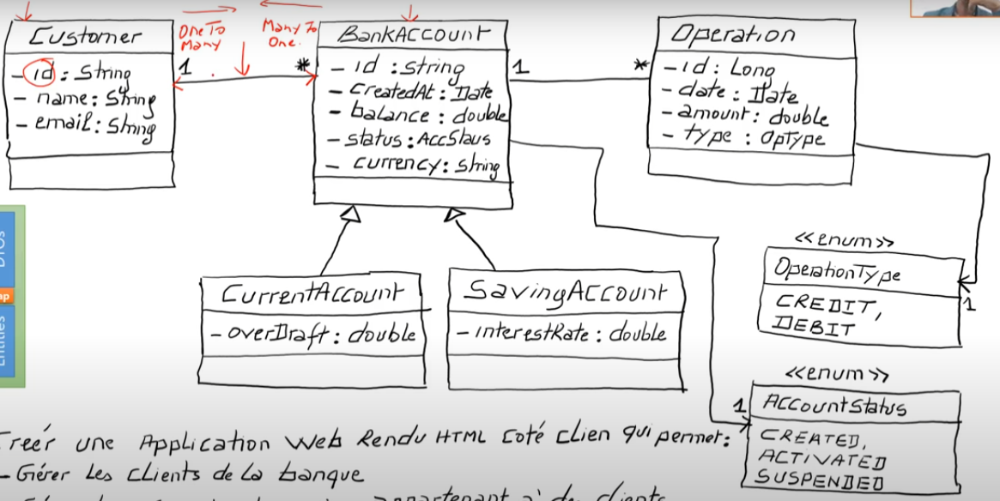</p>
</details>

<details><summary> <h2>Implémentation</h2> </summary>
<ol>
<ul><h4>Backend</h4>
  <ul><h6>Dependances utilisés</h6></ul>

    ```Java
      <dependency>
            <groupId>org.springframework.boot</groupId>
            <artifactId>spring-boot-starter-data-jpa</artifactId>
        </dependency>
        <dependency>
            <groupId>org.springframework.boot</groupId>
            <artifactId>spring-boot-starter-web</artifactId>
        </dependency>

        <dependency>
            <groupId>org.springframework.boot</groupId>
            <artifactId>spring-boot-starter-security</artifactId>
        </dependency>

        <dependency>
            <groupId>com.github.javafaker</groupId>
            <artifactId>javafaker</artifactId>
            <version>1.0.2</version>
        </dependency>

        <dependency>
            <groupId>mysql</groupId>
            <artifactId>mysql-connector-java</artifactId>
        </dependency>
        <dependency>
            <groupId>org.projectlombok</groupId>
            <artifactId>lombok</artifactId>
            <optional>true</optional>
        </dependency>
        <dependency>
            <groupId>org.springframework.boot</groupId>
            <artifactId>spring-boot-starter-test</artifactId>
            <scope>test</scope>
        </dependency>

        <!-- https://mvnrepository.com/artifact/org.springdoc/springdoc-openapi-ui -->
        <dependency>
            <groupId>org.springdoc</groupId>
            <artifactId>springdoc-openapi-ui</artifactId>
            <version>1.6.6</version>
        </dependency>
        <!-- https://mvnrepository.com/artifact/com.auth0/java-jwt -->
        <dependency>
            <groupId>com.auth0</groupId>
            <artifactId>java-jwt</artifactId>
            <version>3.19.2</version>
        </dependency>
    ```

<ul><h6>Structure du Backend</h6>
  <p align="center">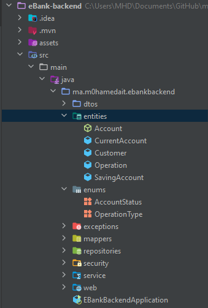</p>

<ul><h4>Classes</h4>
  <ul><h5>Entities</h5></ul>
   <p align="center">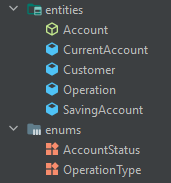</p>
   On a utilisé la stratégie "Single_Table" pour l'héritage, pour créer une seule table avec une column discriminatrice "Type" afin de differencier "CurrentAccount" de "SavingAccount"

  <ul><h5>DTOs</h5></ul>
   <p align="center">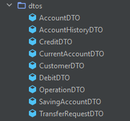</p>
  Les entités JPA ne seront utilisé que dans la couche DAO et la couche Metier, mais pour la couche service on utilise les Data Transfer Object (DTOs)

  <ul><h5>Couche service</h5></ul>
  La couche service sert a definir le fonctionnalités (business logic) de l'application dans une couche a part la couche Web.
   <p align="center"></p>

  <ul><h5>Couche web</h5></ul>
  Dans cette couche, on a défini les `@RestControllers`, qui permet de créer des Restful web services qui s'occupe des requests fait par l'utilisateur
   <p align="center">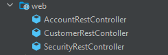</p>
  
  <ul><h5>Couche Sécurité</h5></ul>
  Dans cette application, on a utilisé JWT (Java Web Token) pour sécurité
   <p align="center">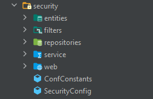</p>
  <p>Pourquoi <strong>JWT</strong> ?<br>
   Pendant longtemps, les cookies Web étaient la méthode la plus courante pour l’authentification des utilisateurs. Même maintenant, cette méthode fonctionne bien à certaines fins. Mais parfois, il faut plus de flexibilité. C’est là qu’intervient JSON Web Token. En tant que norme plus récente et plus ouverte, elle est de plus en plus utilisée par d’importants sites Web et applications.
</p>

</ul>
</details>

<details><summary> <h2>Interfaces</h2> </summary>
<ol>
  <ul><h4>Home</h4>
    <p align="center">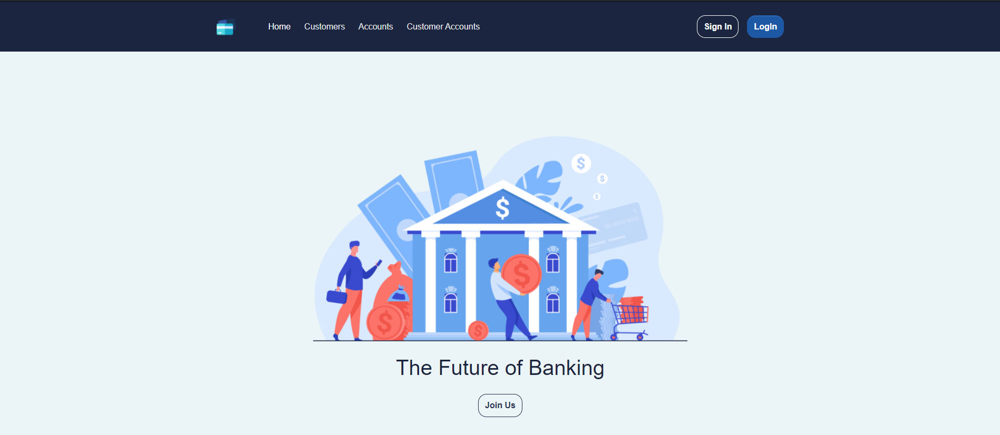</p>
  </ul>
  <ul><h4>Customers</h4>
    <p align="center">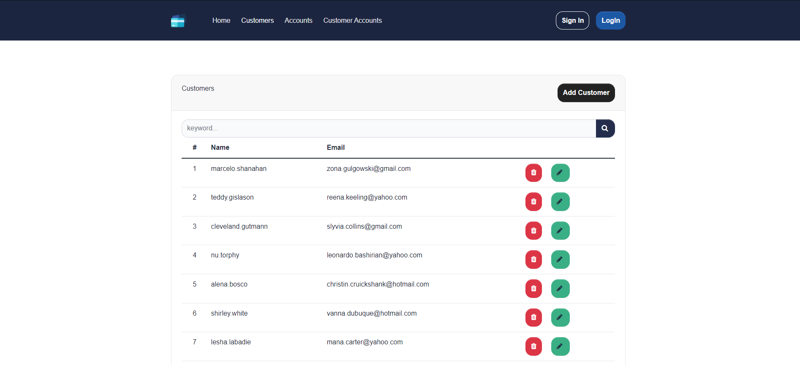</p>
  </ul>
  <ul><h4>accounts</h4>
    <p align="center">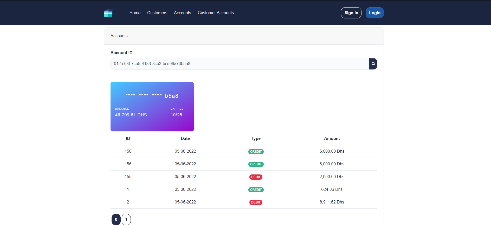</p>
    <p align="center">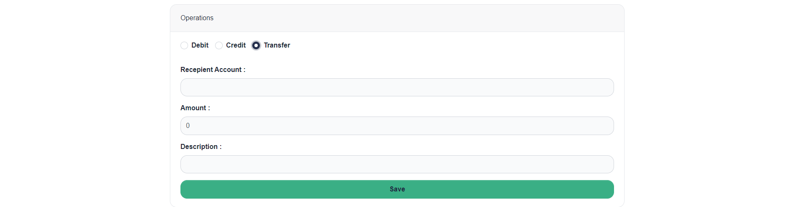</p>
  </ul>
  <ul><h4>Customer Accounts</h4>
    <p align="center">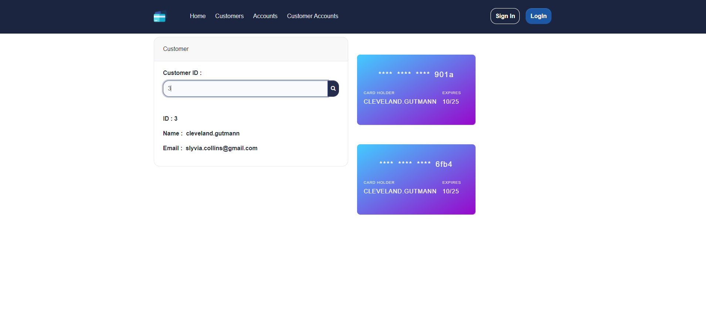</p>
  </ul>
</ol>
</details>
