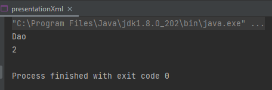
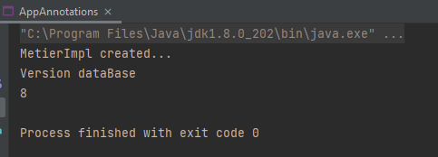

# Mini Projet : Framework d'Injection des dépendances


<details><summary> <h2>Enoncé</h2> </summary>
Concevoir et créer un mini Framework d'injection des dépendances similaire à Spring IOC
Le Framework doit permettre à un programmeur de faire l'injection des dépendances entre les différents composant de son application respectant les possibilités suivantes : 
  <ol>
    <li>A travers un fichier XML de configuration en utilisant Jax Binding (OXM : Mapping Objet XML)</li>
  <li>En utilisant les annotations</li>
  <li>Possibilité d'injection via :
    <ul>
      <li>Le constructeur</li>
      <li>Le Setter</li>
      <li>Attribut (accès direct à l'attribut : Field)</li>
    </ul>
  </li>
  
 </ol>
</details>

<details><summary> <h2>Avec un fichier XML de configuration</h2> </summary>

 <h5> Class Property : </h5>

```Java
@XmlRootElement(name="property")
@XmlAccessorType(XmlAccessType.FIELD)
public class Property implements Serializable {
    @XmlAttribute
    private String name;
    @XmlAttribute
    private String ref;
    @XmlAttribute
    private String value;
}
```

<h5> Class Bean : </h5>

```Java
@XmlRootElement(name="bean")
@XmlAccessorType(XmlAccessType.FIELD)
public class Bean implements Serializable {
    @XmlAttribute
    private String id;
 @XmlAttribute(name="class")
private String cclass;
private Property property;

    public String getId() {
        return id;
    }

    public String getCclass() {
        return cclass;
    }

}
  ```

  <h5> Class Beans : </h5>

```Java
@XmlRootElement(name="beans")
@XmlAccessorType(XmlAccessType.FIELD)
public class Beans implements Serializable {
    @XmlElement(name="bean")
    private List<Bean> beans;

    public List<Bean> getBeans() {
        return beans;
    }

    public void setBeans(List<Bean> beans) {
        this.beans = beans;
    }
}
```

 <h5> Class ClassPathXmlApplicationContext : </h5>

```Java
public class ClassPathXmlApplicationContext {
    private String file;

    public ClassPathXmlApplicationContext(String file) {
        this.file = file;
    }

    public Object getBean(String name) throws Exception {
        JAXBContext context = JAXBContext.newInstance(Beans.class);
        Unmarshaller unmarshaller = context.createUnmarshaller();
        Beans b = (Beans) unmarshaller.unmarshal(new File(this.file));
        List<Bean> beans = b.getBeans();


        for(Bean bean:beans){
            if(bean.getId().equals(name)){
                Class cl = Class.forName(bean.getCclass());
                return cl.newInstance();
            }
        }

        return null;
    }

    public String getFile() {
        return file;
    }

    public void setFile(String file) {
        this.file = file;
    }
}
```

<h5>Fichier de configuration xml</h5>

```xml
<?xml version="1.0" encoding="UTF-8"?>
<beans>
    <bean id="dao" class="tests.testXML.dao.DaoImpl"></bean>
    <bean id="metier" class="tests.testXML.metier.MetierImplWS">
        <property name="dao" ref="dao"></property>
    </bean>
</beans>

```

<h5>Test</h5>
<h6>Application</h6>

```Java
public class presentationXml {
    public static void main(String[] args) throws Exception {
        ClassPathXmlApplicationContext context = new ClassPathXmlApplicationContext("src/main/resources/applicationContext.xml");
        IDao dao = (IDao) context.getBean("dao");

        System.out.println(dao.getData());

    }
}
```

<h6>class Dao</h6>

```Java
public class DaoImpl implements IDao{
    @Override
    public int getData(){
        System.out.println("Dao");
        return 2;
    }
}
```

<h6>Resultat du test</h6>


</details>

<details><summary> <h2>Avec Annotations</h2> </summary>
<h4>Annotations</h4>
  <h6>Annotation Component</h6>

  ```Java
  @Retention(RetentionPolicy.RUNTIME)
@Target(ElementType.TYPE)
public @interface Component {
    String name() default "";
}

```

 <h6>Annotation Autowired</h6>

  ```Java
@Retention(RetentionPolicy.RUNTIME)
@Target({ElementType.FIELD, ElementType.CONSTRUCTOR, ElementType.METHOD})
public @interface Autowired {

}
```

 <h6>Annotation Qualifier</h6>

  ```Java
@Retention(RetentionPolicy.RUNTIME)
@Target({ElementType.FIELD, ElementType.CONSTRUCTOR, ElementType.METHOD})
public @interface Qualifier {
    String name();
}

```

<h4>AnnotationConfigApplicationContext</h4>

  ```Java
public class MyAnnotationConfigApplicationContext {
    HashMap<Class, Object> classInstances = new HashMap<>();
    List<String> packages = new ArrayList<>();

    public MyAnnotationConfigApplicationContext(String... packages) {
        this.packages.addAll(Arrays.asList(packages));
    }

    public void getClasses() throws InstantiationException, IllegalAccessException, NoSuchMethodException, SecurityException, IllegalArgumentException, InvocationTargetException {
        ArrayList<Class> classes=new ArrayList<Class>();
        AccessPackageReflexions accessPackageReflexions = new AccessPackageReflexions();
        Set<Class<?>> subTypesOf=null;
        String method=null;

        for(String packageName : packages) {
            Reflections reflexions = new Reflections(new ConfigurationBuilder()
                    .setScanners(new SubTypesScanner(false), new ResourcesScanner())
                    .addUrls(ClasspathHelper.forJavaClassPath())
                    .filterInputsBy(new FilterBuilder()
                            .include(FilterBuilder.prefix(packageName))));

            subTypesOf = reflexions.getSubTypesOf(Object.class);
            for( Class c :subTypesOf) {
                if(c.toString().contains("class")) {
                    Object o = c.newInstance();
                    classInstances.put(c.getInterfaces()[0], o);
                    classes.add(c);
                }
            }


        }
        //injection
        for(Class cl : classes) {
            if(cl.getAnnotations().length>0) {
                if( cl.getAnnotations()[0].toString().contains("Component") && cl.getDeclaredFields().length>0 ) {
                    Field[] fields =cl.getDeclaredFields();
                    for(Field f : fields) {
                        if(f.getAnnotations()[0].toString().contains("Autowired"))
                        {
                            method="set"+f.getName().substring(0, 1).toUpperCase() + f.getName().substring(1, f.getName().length());
                            Method methode=cl.getMethod(method,f.getType());
                            methode.invoke(classInstances.get(cl.getInterfaces()[0]), classInstances.get(f.getType()));
                        }
                    }
                }
            }
        }

    }
    public HashMap<Class, Object> getInstances(){
        return classInstances;
    }
}

```

<h4>Test</h4>
<h6>Application</h6>

  ```Java
public class AppAnnotations {
    public static void main(String[] args) throws InvocationTargetException, InstantiationException, IllegalAccessException, NoSuchMethodException {
        MyAnnotationConfigApplicationContext context = new MyAnnotationConfigApplicationContext("testAnnotations.dao", "testAnnotations.metier");
        context.getClasses();  // create instances of classes annotated with @Component and @Autowired

        IMetier metier = (IMetier) context.getInstances().get(IMetier.class);

        System.out.println(metier.calcul());
    }

}

```

<h6>Class MetierImpl auquelle on a ajouter les annotations</h6>

  ```Java
@Component
public class MetierImpl implements IMetier {
    @Autowired
    private IDao dao;

    public MetierImpl() {
        System.out.println("MetierImpl created...");
    }

    @Override
    public int calcul(){
        System.out.println("Version dataBase");
        return dao.getData() * 4 ;
    }

    public void setDao(IDao dao) {
        this.dao = dao;
    }
}
```


<h6>Resultat test</h6>


</details>
