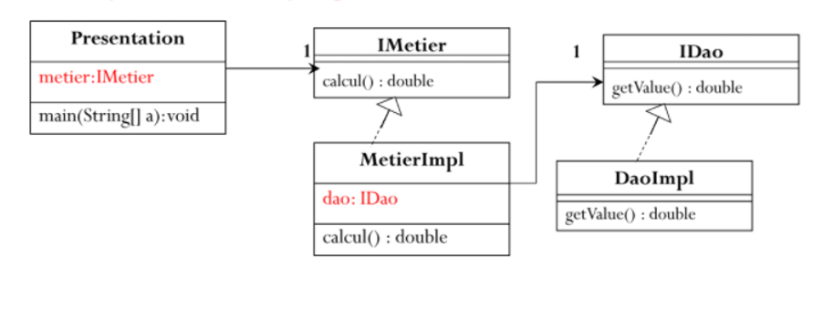

# TP1 : Inversion de contrôle et Injection des dépendances

 <h2>Introduction</h2> 

<b>L’inversion de contrôle</b> (inversion of control, IoC) est un patron d'architecture commun à tous les frameworks (ou cadre de développement et d'exécution). Il fonctionne selon le principe que le flot d'exécution d'un logiciel n'est plus sous le contrôle direct de l'application elle-même mais du framework ou de la couche logicielle sous-jacente.

L’inversion de contrôle est un terme générique. Selon le problème, il existe différentes formes, ou représentation d'IoC, le plus connu étant <i>l'injection de dépendances</i>.

<b>L'injection de dépendances</b> (dependency injection) est un patron de conception permettant, en programmation orientée objet, de découpler les dépendances entre objets.

 <h2>Enoncé</h2> 

Rendre un compte rendu en reprenant l'exemple traité dans les vidéos des deux dernières séances :
<ol>
<li> Créer l'interface IDao</li>
<li> Créer une implémentation de cette interface</li>
<li> Créer l'interface IMetier</li>
<li> Créer une implémentation de cette interface en utilisant le couplage faible</li>
<li> Faire l'injection des dépendances :</li>
<ul>
<li> Par instanciation statique</li>
<li> Par instanciation dynamique</li>
<li>En utilisant le Framework Spring
  <ul>
  <li> Version XML</li>
  <li> Version annotations</li>
  </ul>
</li>
</ul>
</ol>

 <h2>Conception</h2> 

  

 <h2>Captures d'écran</h2> 

<ol>
<li> Créer l'interface IDao</li>

<li> Créer une implémentation de cette interface</li>

<li> Créer l'interface IMetier</li>

<li> Créer une implémentation de cette interface en utilisant le couplage faible</li>

<li> Faire l'injection des dépendances :</li>
<ul>
<li> Par instanciation statique</li>

<li> Par instanciation dynamique</li>
<b>Fichier</b> <code>config.txt</code> 
   

<li>En utilisant le Framework Spring
  <ul>
  <li> Version XML</li>
   <b>Fichier</b> <code>applicationContext.xml</code>
  
  
  <li> Version annotations</li>
  
  </ul>
</li>
</ul>
</ol>

