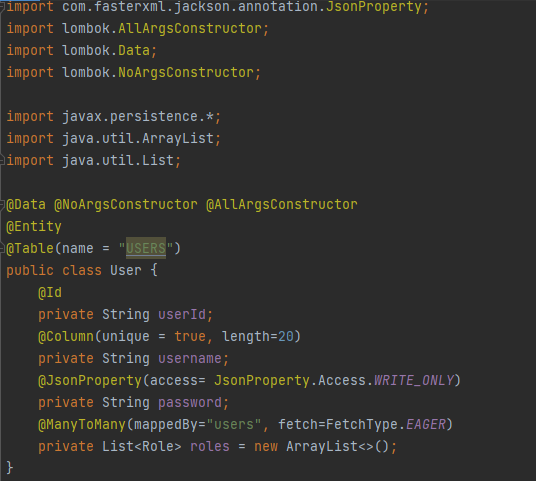

# TP3 : Mapping objet relationnel avec JPA, Hibernate et Spring Data : Cas de Patient, Medecin, Rendez-vous, Consultation

 <h2>Introduction</h2> 

<b>ORM (Object Relational Mapping)</b> est un système qui met en œuvre la responsabilité du mappage de l'objet au modèle relationnel. Cela signifie qu'il est responsable du stockage des données du modèle objet dans le modèle relationnel et de la lecture des données du modèle relationnel dans le modèle objet. 
<b>JPA :</b> (Java persistence api) qui fournit des spécifications pour la persistance, la lecture et la gestion des données de votre objet Java vers des relations dans la base de données. 
<b>Hibernate :</b> Il existe plusieurs frameworks qui mettent en œuvre JPA. Hibernate est l'un d'entre eux. Il existe également d'autres frameworks. Mais si vous utilisez jpa avec spring, cela vous permet de passer à différents frameworks à l'avenir. 
<b>Spring Data JPA :</b> C'est une autre couche au-dessus de jpa que Spring fournit pour vous faciliter la vie.

 <h2>Enoncé</h2> 

Reprendre les exemples de mapping objet relationnel avec JPA, Hibernate et Spring Data : 
- Cas de Users et Roles

 <h2>Conception</h2> 

  

 <h2>Captures d'écran</h2> 

<ol>
<ul><h4>Entities</h4>
  <ul><h6>User</h6></ul>
  
  <ul><h6>Role</h6></ul>
  
</ul>

<ul><h4>Repositories</h4>
  <ul><h6>User Repository</h6></ul>
  
  <ul><h6>Role Repository</h6></ul>
  
</ul>

<ul><h4>Services</h4>
  <ul><h6>User service Interface</h6></ul>
  
  <ul><h6>User service Implementation</h6></ul>
  
  
</ul>

<ul><h4>Controllers</h4>
  <ul><h6>Rest Contoller</h6></ul>
  
</ul>

<ul><h4>Application</h4>
  
  
</ul>

<ul><h4></h4>
  
</ul>

</ol>

