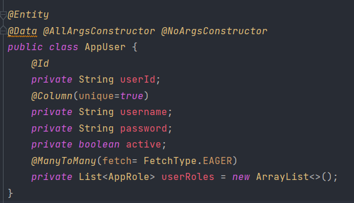

# TP6 : Activité Pratique Spring MVC Thymeleaf

 <h2>Enoncé</h2> 

Créer une application Web JEE basée sur Spring MVC, Thylemeaf et Spring Data JPA qui permet de gérer les patients. L'application doit permettre les fonctionnalités suivantes :
  - Afficher les patients
  - Faire la pagination
  - Chercher les patients
  - Supprimer un patient
  - Faire des améliorations supplémentaires

 <h2>Conception</h2> 

  

 <h2>Captures d'écran</h2> 

<ol>
<ul><h4>Entities</h4>
  <ul><h6>Patient</h6></ul>
  
</ul>

<ul><h4>Repositories</h4>
  <ul><h6>Patient Repository</h6></ul>
  
</ul>

<ul><h4>Services</h4>
  <ul><h6>Hopital service Interface</h6></ul>
  
  <ul><h6>Hopital service Implementation</h6></ul>
  
</ul>

<ul><h4>Controllers</h4>
  <ul><h6>Patient Controller</h6></ul>
  
  
</ul>

<ul><h4>Security</h4>
  <ul><h5>Entities</h5>
  <ul><h6>AppUser</h6></ul>
  
  <ul><h6>AppRole : les roles que peut avoir les utilisateurs</h6></ul>
  
  </ul>

  <ul><h5>Repositories</h5>
    <ul><h6>AppUser Repository</h6></ul>
    
    <ul><h6>AppRole Repository</h6></ul>
    
  </ul>

  <ul><h5>Services</h5>
    <ul><h6>Security service</h6></ul>
    
    <ul><h6>Security service Implementation</h6></ul>
    
    
    <ul><h6>UserDetails service Implementation</h6></ul>
    
  </ul>

  <ul><h5>Controllers</h5>
    <ul><h6>Security Controller</h6></ul>
    
  </ul>

  <ul><h5>Configuration</h5>
    <ul><h6>Security Config</h6></ul>
    
  </ul>
</ul>
</ol>

 <h2>Interfaces</h2> 

<ol>
  <ul><h4>Login page</h4>
    
  </ul>
  <ul><h4>Login en tant que ADMIN</h4>
    <ul><h6>Home</h6></ul>
    
    <ul><h6>Add patient</h6></ul>
      
      
    <ul><h6>Update Patient</h6></ul>
      
      
      
    <ul><h6>Delete Patient</h6></ul>
      
      
  </ul>
  <ul><h6>Login en tant qu'USER</h6>
    
USER ne peut que voir la liste des patients et faire une recherche

    
  </ul>

  <h2>Améliorations supplémentaires</h2>
  <ol>
    <ul>Fake data avec Faker</ul>
    <ul>Messages de validation avec Spring boot validation</ul>
    <ul>Page Login personnalisé</ul>
    <ul>Page 403</ul>

  </ol>
</ol>

